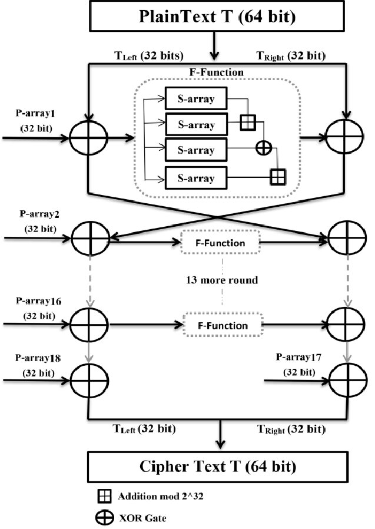

**Projekt z przedmiotu Matematyka dyskretna**

**Politechnika Krakowska, 2025**

**Autor: Jakub Kapała (magnuschase)**

# Opis algorytmu Blowfish

Blowfish to symetryczny algorytm szyfrowania blokowego zaprojektowany przez Bruce’a Schneiera w 1993 roku. Powstał jako szybka i bezpłatna alternatywa dla istniejących w tym czasie algorytmów. Bazuje on na strukturze stosowanej w budowie symetrycznych algorytmów szyfrujących - sieci Feistela. Na jego bazie powstała jedna z najbardziej powszechnie używanych funkcji do hashowania haseł - `bcrypt`, autorstwa Nielsa Provosa i Davida Mazièresa, zaprezentowana na konferencji USENIX w 1999 roku [[1]](#references).

## Parametry:

- Długość bloku: 64 bity (8 bajtów)
- Długość klucza: od 32 do 448 bitów
- Struktura: 16 rund Feistela
- Operacje: XOR, dodawanie modulo $2^{32}$, podstawienia (S-boxy)

## Struktura algorytmu:

- Algorytm dzieli blok wejściowy na dwie połowy: \( L \) i \( R \).

- W każdej rundzie:
  $$
  \begin{aligned}
    L_i &= R_{i-1} \\
    R_i &= L_{i-1} \oplus F(R_{i-1}) \oplus P_i
  \end{aligned}
  $$
- Po 16 rundach następuje końcowy swap oraz operacja XOR z tablicą \( P \).

- W algorytmie wykorzystywane są 4 tablice S-boxów oraz tablica P-array zawierająca podklucze.

  
_Struktura algorytmu Blowfish [[2]](#references)_

## Pseudokod algorytmu

```text

P[18] // P: tablica 18-elementowa
S[4][256] // S: 4 tablice po 256 elementów

F(x):
    a, b, c, d := 8-bitowe segmenty wejścia x
    zwróć ((S1[a] + S2[b]) XOR S3[c]) + S4[d]

Blowfish_Encrypt_Block(L, R):
    dla każdego i od 1 do 16:
        L := L XOR P[i]
        R := F(L) XOR R
        zamień L oraz R
    zamień L oraz R
    R := R XOR P[17]
    L := L XOR P[18]
    zwróć (L, R)

Blowfish_Decrypt_Block(L, R):
    dla każdego i od 17 do 2:
        L := L XOR P[i]
        R := F(L) XOR R
        zamień L oraz R
    zamień L oraz R
    R := R XOR P[1]
    L := L XOR P[0]
    zwróć (L, R)
```

Jak możemy zauważyć, w powyższym pseudokodzie uwzględniłem funkcje `F`, `Blowfish_Encrypt_Block` oraz `Blowfish_Decrypt_Block`. Do pełnego działania algorytmu będziemy jednak potrzebować także funkcje pomocnicze (`Pad`, `Unpad`), które pomimo tego, że nie są częścią samego szyfrowania, są integralną częścią implementacji algorytmu. Funkcje te dodają otoczkę, która pozwoli nam na bezpośrednie zastosowanie tego algorytmu na tekście, bez widocznego podziału na bloki. Ostatnią częścią pseudokodu są funkcje składające wszystko w jedną spójną całość - `Blowfish_Encrypt_Text` oraz `Blowfish_Decrypt_Text`.

```text
Pad(text):
    pad_len := 8 - (długość(text) mod 8)
    dodaj pad_len bajtów o wartości pad_len na koniec text
    zwróć text

Unpad(text):
    pad_len := ostatni bajt z text
    usuń pad_len bajtów z końca text
    zwróć text

Blowfish_Encrypt_Text(plaintext):
    plaintext := Pad(plaintext)
    ciphertext := pusty ciąg bajtów
    dla każdego 8-bajtowego bloku w plaintext:
        (L, R) := interpretuj blok jako dwie liczby 32-bitowe
        (L_enc, R_enc) := Blowfish_Encrypt_Block(L, R)
        dodaj (L_enc, R_enc) do ciphertext jako 8 bajtów
    zwróć ciphertext

Blowfish_Decrypt_Text(ciphertext):
    plaintext := pusty ciąg bajtów
    dla każdego 8-bajtowego bloku w ciphertext:
        (L, R) := interpretuj blok jako dwie liczby 32-bitowe
        (L_dec, R_dec) := Blowfish_Decrypt_Block(L, R)
        dodaj (L_dec, R_dec) do plaintext jako 8 bajtów
    plaintext := Unpad(plaintext)
    zwróć plaintext
```

# Implementacja

W ramach projektu zaimplementowałem algorytm Blowfish jako moduł Pythona. Znajduje się on w folderze `blowfish_pk`.

## Plik `core.py`

W tym pliku znajduje się rdzeń modułu - implementacja algorytmu szyfrującego Blowfish - funkcja `F` oraz funkcje szyfrujące bloki `L` i `R` - `encrypt_block` oraz `decrypt_block`. Dodatkowo mamy tutaj funkcje do zarządzania używanymi kluczami - `generate_keys`, `save_keys` oraz `load_keys`. Ze względu na generacje kluczy jako int32 zamiast wartości heksadecymalnej, musimy pamiętać o maskowaniu przypisywanej wartości w funkcjach szyfrujących / deszyfrujących bloki.

```python
import secrets
import json
import os

# Default keys for simplified Blowfish algorithm
P_ARRAY = [0x243F6A88, 0x85A308D3] + [0] * 16
S_BOXES = [[i for i in range(256)] for _ in range(4)]

# Generation of random keys for Blowfish - int32 arrays
# Since keys are 32 bit integers, we need to mask values to 32 bits during encryption/decryption
def generate_keys():
    global P_ARRAY, S_BOXES
    P_ARRAY = [secrets.randbits(32) for _ in range(18)]
    S_BOXES = [[secrets.randbits(32) for _ in range(256)] for _ in range(4)]

def save_keys(filename="blowfish_keys.json"):
    keys = {
        "P_ARRAY": P_ARRAY,
        "S_BOXES": S_BOXES
    }
    with open(filename, "w") as f:
        json.dump(keys, f)

def load_keys(filename="blowfish_keys.json"):
    global P_ARRAY, S_BOXES
    if not os.path.exists(filename):
        raise FileNotFoundError(f"Key file '{filename}' not found.")
    with open(filename, "r") as f:
        keys = json.load(f)
        P_ARRAY = keys["P_ARRAY"]
        S_BOXES = keys["S_BOXES"]

def F(x):
    a = (x >> 24) & 0xFF
    b = (x >> 16) & 0xFF
    c = (x >> 8) & 0xFF
    d = x & 0xFF
    return (((S_BOXES[0][a] + S_BOXES[1][b]) & 0xFFFFFFFF) ^ S_BOXES[2][c] + S_BOXES[3][d]) & 0xFFFFFFFF

def encrypt_block(L, R):
    for i in range(16):
        L = (L ^ P_ARRAY[i]) & 0xFFFFFFFF
        R = (R ^ F(L)) & 0xFFFFFFFF
        L, R = R, L
    L, R = R, L
    R = (R ^ P_ARRAY[16]) & 0xFFFFFFFF
    L = (L ^ P_ARRAY[17]) & 0xFFFFFFFF
    return L, R

def decrypt_block(L, R):
    for i in reversed(range(2, 18)):
        L = (L ^ P_ARRAY[i]) & 0xFFFFFFFF
        R = (R ^ F(L)) & 0xFFFFFFFF
        L, R = R, L
    L, R = R, L
    R = (R ^ P_ARRAY[1]) & 0xFFFFFFFF
    L = (L ^ P_ARRAY[0]) & 0xFFFFFFFF
    return L, R
```

## Plik `utils.py`

W tym pliku znajdują się funkcje pomocnicze `pad` oraz `unpad`, oraz finalne funkcje służące do bezpośredniego użycia przez użytkownika - `encrypt_text` oraz `decrypt_text`.

```python
import struct
from .core import encrypt_block, decrypt_block

def pad(text: bytes) -> bytes:
    pad_len = 8 - (len(text) % 8)
    return text + bytes([pad_len] * pad_len)

def unpad(text: bytes) -> bytes:
    pad_len = text[-1]
    return text[:-pad_len]

def encrypt_text(plaintext_bytes: bytes) -> bytes:
    ciphertext = b""
    padded = pad(plaintext_bytes)
    for i in range(0, len(padded), 8):
        block = padded[i:i+8]
        L, R = struct.unpack('>II', block)
        L_enc, R_enc = encrypt_block(L, R)
        ciphertext += struct.pack('>II', L_enc, R_enc)
    return ciphertext

def decrypt_text(ciphertext_bytes: bytes) -> bytes:
    plaintext = b""
    for i in range(0, len(ciphertext_bytes), 8):
        block = ciphertext_bytes[i:i+8]
        L, R = struct.unpack('>II', block)
        L_dec, R_dec = decrypt_block(L, R)
        plaintext += struct.pack('>II', L_dec, R_dec)
    return unpad(plaintext)
```

## Przykład użycia

Poniższy przykład znajduje się również w pliku `example.py`, będącym częścią modułu `blowfish_pk`.

```python
import sys
import os
sys.path.append(os.path.abspath(os.path.join(os.getcwd(), '..')))

from blowfish_pk.utils import encrypt_text, decrypt_text
from blowfish_pk.core import generate_keys, save_keys
# from blowfish_pk.core import load_keys

if __name__ == "__main__":
    # Key generation & saving
    generate_keys()
    save_keys("keys_example.json")

    # Loading keys
    # load_keys("keys_example.json")

		# Example usage
    plaintext = b"To jest tajna wiadomosc!"
    print(f"Plaintext: {plaintext}")

    encrypted = encrypt_text(plaintext)
    print(f"Encrypted: {encrypted}")

    decrypted = decrypt_text(encrypted)
    print(f"Decrypted: {decrypted}")
```

    Plaintext: b'To jest tajna wiadomosc!'
    Encrypted: b'\xe0\xd0|=pPI<\xe4\x83~|P^\x000\xea\xd0k\x11E[\x06N\x8d\xab\x00\x7f,7a\xe2'
    Decrypted: b'To jest tajna wiadomosc!'

---

## Bibliografia

1. Provos, N., & Mazières, D. (1999). A Future-Adaptable Password Scheme. _USENIX Annual Technical Conference_. [PDF](https://www.usenix.org/legacy/events/usenix99/full_papers/provos/provos.pdf)
2. Kareem, S. A., & Salim, N. A. (2023). Structure of Blowfish encryption algorithm. [DOI](https://doi.org/10.11591/ijeecs.v29.i1.pp339-347)
